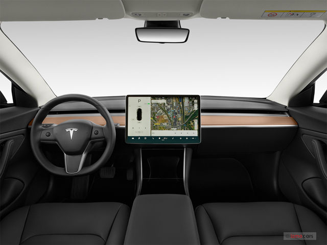
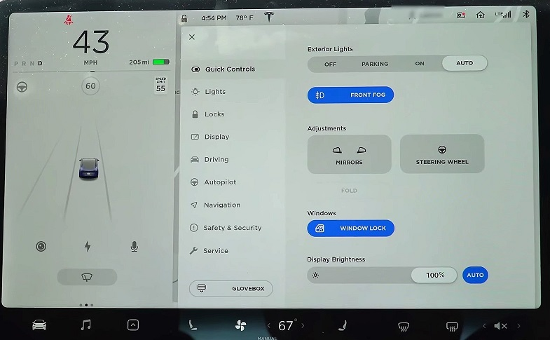
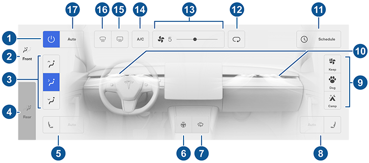
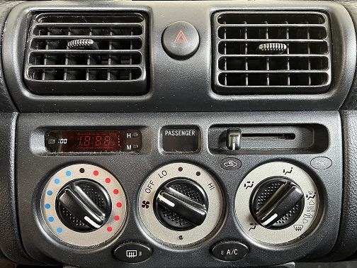

[ux-portfolio-jpawek](https://usabilityengineering.github.io/ux-portfolio-jpawek/)
# The Questionable UX of Tesla
By Joseph Pawek, 3/10/2023
---

After landing his job at Google my brother's first big purchase was a Tesla Model 3 Performance. It has all of the gas saving benefits of an electric vehicle, capable safety equipment, a blisteringly fast 0-60 speed, and, importantly for this journal entry, heaps and heaps of intricate features in a minimalist design.

If you are unfamiliar with Tesla's interior design style, the front dash of the Model 3 looks like this:

Notice that there is a complete lack of analog buttons on the dashboard. In fact, it is so minimalist that even the A/C vents are tucked away and hidden, making them impossible to adjust physically. As such, any **conventions** of control that a user is accustomed to out of other vehicles do not apply.  

The control features that would typically be found in the cabin are instead integrated in the central touchscreen which acts as a display for the speedometer, navigation, radio and music controls, climate control settings, current drive mode, autopilot status, and quite a bit more. There are so many features that there are a total of 14 pages in the Model 3 owner's manual that focus purely on controlling the touchscreen.

Specifically I'd like to focus on my experience with managing the climate control settings. The homepage of the central screen provides a simple temperature display. This can be changed by single degrees or if you tap and hold the number you can use a slider for greater temperature changes. You can see it along with buttons to toggle defrosters and seat heaters at the bottom of this image:

This works fine when you want to leave the climate control system on auto and let the car control the ambient temperature. It's an easily **learnable** and **effective** control, it does its job well with a straight forward control scheme that can quickly be understood.

However, once you want to take the climate control out of auto and make specific manual adjustments it gets a bit more complicated. For example, one time after going on a long hike I wanted to max out the A/C and point the vents towards myself. In order to adjust the climate control system manually you first have to tap the fan icon on the homepage, something that isn't immediately obvious. Then you are met with the climate control screen with all of its settings. Here is a diagram for the screen out of the Model 3 owner's manual:

Fan speed sits at the top of the screen with a control slider and the A/C toggle button sits next to it, which are simple enough. My main problem was with directing the airflow of the vents. In order to change this you have to tap on the animated air currents in the center of the screen, labeled 10 in the diagram, and then hold and drag across the screen to shift the direction of the airflow. This is strange for a number of reasons, primarily because the **mapping** of the action is off. That is to say that the action of tapping and dragging on a screen positioned to your left or right in order to shift the airflow from a vent located directly in front of you creates a disconnect from the controls and the physical action that they perform.

In summary, in order to max out the cold A/C and point the vents in my direction I had to tap and hold the temperature setting, set the slider to the minimum, tap the climate control icon, navigate to the fan speed and max it out, toggle the A/C, figure out how to adjust the vent direction, and then shift the airflow with its strange control mapping. All of this was done while sitting in the passenger seat with the vehicle stationary. I haven't had to adjust the A/C while I've driven the car, but I'd imagine that would make the process at least twice as difficult, not to mention pretty unsafe.

For comparison, in my 22 year old Toyota MR2 I would turn the A/C dial to cold, turn the fan dial to max speed, toggle the A/C button, and then point the vents at myself, all of which is a **conventional** and well labeled process that is easily performed. Here you can see the comparitive simplicity of the controls:

